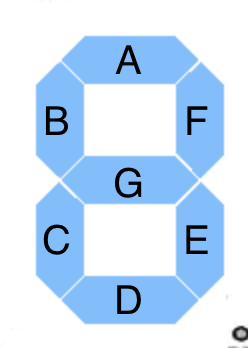
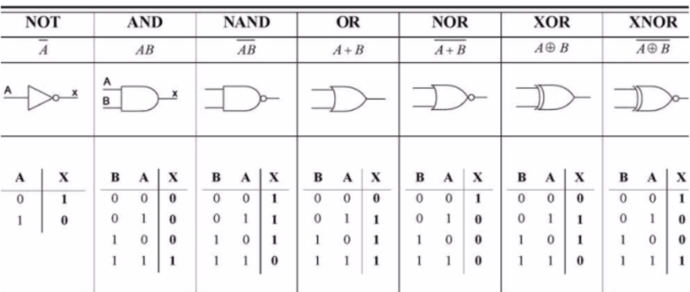
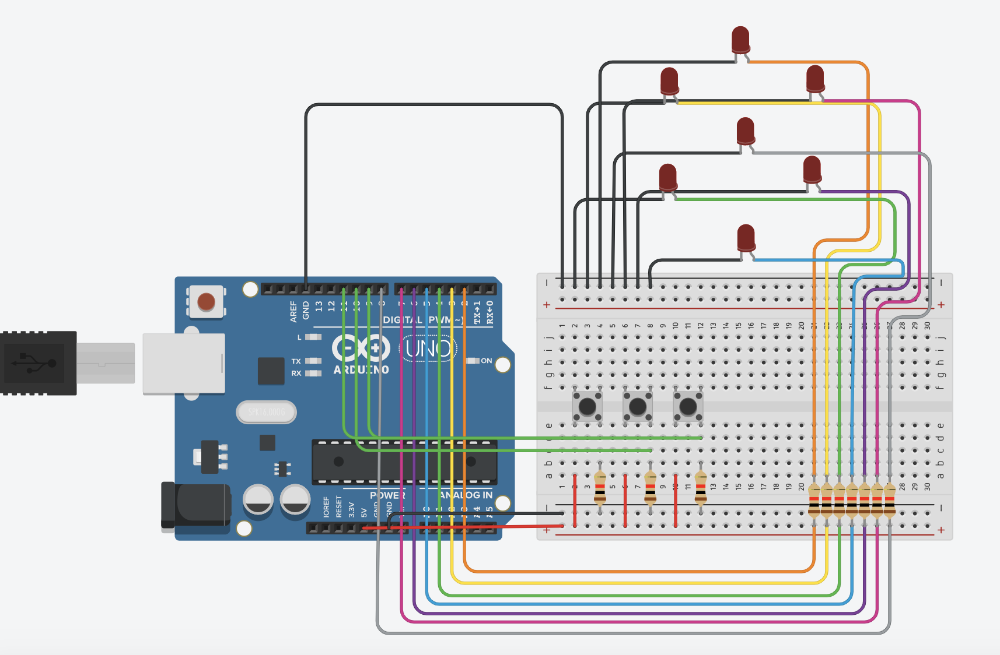

Unit 2
======

An English, morse, and binary translation program to theoretically enable communication between Earth, the Moon, and Mars, coded in Modern C and run on an Arduino UNO. 

Contents
-----
  1. [Planning](#planning)
  1. [Design](#design)
  1. [Development](#development)
  1. [Evalution](#evaluation)
  1. [Citations](#citations)

Planning
----------
**Defining the Problem:**
For this problem, we are trying to solve a communication issue between Earth, the Moon, and Mars. Essentially, each location has transmittors and receivers which are only capable of receiving two pieces of information. 

For Mars, the planet is only able to send and receive binary. For Earth, the planet is only able to send and receive morse code. The Moon, therefore, acts as a liason between the two planets and works to translate Morse code into binary or the opposite. However, the operators in these planets can only understand English so each language must be translated into English before being transmitted. 

**Creating Success Criteria:**
Who is the client? What is the need? What is the proposed solution? Create success criteria and use your imagination.

The client in this case, NASA, needs to be able to translate binary, morse code, and English. To create a system which performs these actions, we propose 

1. Must be able to enter English
2. Must have only two inputs
3. May use as many LEDs (outputs) as needed 

**System Diagram:**
My task specifically here is to ask as the translator on planet Earth, meaing that I need to be able to translate between morse code and English. 

**Differences between Modern C and Bash:** 
Modern C and Bash both have many similarities; however, they also have many characteristics which demonstrate their differences:

| Modern C        | Bash           | 
| :-----------: |:-------------:| 
| Syntax is more forgiving     | More capable | 
| More resources online      | Runs directly on computer with installation      |   
| Integrated with hardware (Arduino) | Integrated with computer and can perform actions within OS      |    

Design
------

**Modern C**
Obtaining a basic understanding or Modern C is essential to being able to design an effective system which can translate binary, English, and morse code. In order to get started with this, let's take a look at the different types of integers within Modern C:
1. A boolean is a variable which can only hold two values, true or false which only uses 1 byte. 
2. A float is a number which has a decimal point which is stored as 4 bytes. 
3. A word stores an unsigned number from 0 to 65,535.
4. A long is an extended numerical variable which covers from -2,147,483,648 to 2,147,483,647.
5. A char stores a single character as a value. 
6. An unsigned char encodes numbers from 0 to 255. 
7. An int stores an integer from -32,768 to 32,767. 
8. An unsigned int is the same as an int yet it lacks the negative values, resulting in it ranging from 0 to 65,535.

These eight types of variables enable us to cast a wide net and find a variable which meets our own particular needs. While some of they may be multifunctional, it is best to find the one best directed for our needs in order to minimize the memory used storing our variable. 

Another interesting function with Modern C is "void," used for declaring functions. It ensures that the function is expected not to have an output back to its original function. 

**Usability & Human-centered Design (HCD)**
Usability is essentially how easily something can be learned and used [1], specifically for a human-made technology. This is especially relevant to concepts such as something being intuitive, elegant, or clear. 

At the core of human-centered design is feedback and discoverability [2].

**What is the volatile data type in Arduino?**

Development
-----------
**Counting with binary:**
We learned to count with binary, a necessary step for converting data from English to binary and vice versa. Essentially, in binary, you start off by representing zero as one. Then, whenever the last digit is zero, you change the number to one. 

This strategy yields us the number zero as 0 and the number one as 1. From there, however, it gets slightly more complicated. Whenever the last digit is one, then you add another one which would result in 2 but is formatted as 10. Thus, number three would be represented as 10. From there on, the same strategy could be used to receive all the numbers from zero to fifteen: 0, 1, 10, 11, 100, 101, 110, 111, 1000, 1001, 1010, 1011, 1100, 1101, 1110, 1111. 

**Representing numbers in binary through LED lights:**
How many led lights do you need to show the numbers from 1 to 15? Have two led lights. Flash red for one, flash white for zero.

We began to answer this question by seeing how Arduino can be used to make a single LED flash. Here, we can see an LED flashing: 


While this is simply one flash, the program can be adjusted for additional LEDs and also for different timed pulses of light. The code is quite simple for something such as a single light flash:
```.ino
int redLED = 13;

void setup() {
  pinMode(redLED, OUTPUT);
  
}

void loop() {
  blinkRed(1000);
  blinkRed(100);
}

void blinkRed(int t){
  digitalWrite(redLED, HIGH);
  delay(t);
  digitalWrite(redLED, LOW);
  delay(t);
}
```

**Using buttons to trigger lights:**

Using an Arduino, we can use buttons to trigger lights. While this can simply be done by using a large amount of "if else" statements, this problem can also be solved quite easily with logic gates. By noticing patterns in between inputs and outputs, the logic gates of "or," "and," "not," and "xor" can be used to simplify an equation for the output. 

For example, in a scenario in which Button A and Button B not being pressed as well as just Button A being pressed results in a light being pressed, the following code could be created: ` if(digitalRead(!butB)==HIGH); digitalWrite(out1, HIGH);}`.
These logical gates can be used for a variety of other outputs as well. 

**Converting from decimal to a seven segment number:**
Since this project is based around converting numbers from decimal to binary and morse code, and vice versa, it is useful to practice the use of logic gates by creating a system in which decimal numbers are converted to a seven segment number. To do this, we essentially made a table in which 

| Button A  | Button B    | Button C     | Decimal Number | A | B | C | D | E | F | G |
| :----: |:----:| :----:|:----:|:----:|:----:|:----:|:----:|:----:|:----:|:----:|
| 0 | 0 | 0 | 0 | 1 | 1 | 1 | 1 | 1 | 1 | 0 |
| 0 | 0 | 1 | 1 | 0 | 0 | 0 | 0 | 1 | 1 | 0 |
| 0 | 1 | 0 | 2 | 1 | 0 | 1 | 1 | 0 | 1 | 1 |
| 0 | 1 | 1 | 3 | 1 | 0 | 0 | 1 | 1 | 1 | 1 |
| 1 | 0 | 0 | 4 | 0 | 1 | 0 | 1 | 1 | 1 | 1 |
| 1 | 0 | 1 | 5 | 1 | 1 | 0 | 1 | 1 | 0 | 1 |
| 1 | 1 | 0 | 6 | 1 | 1 | 1 | 1 | 1 | 0 | 1 |
| 1 | 1 | 1 | 7 | 1 | 0 | 0 | 0 | 0 | 1 | 1 |

Using this table, we can create equations for each LED in the seven segment number (see image below for an example).



When you make equations using the logic gates learned earlier, you can form one individual equation and then put set that equal to a boolean to minimize the number of lines needed to code the program. The following code effectively uses logic gates to make a system which lights up a seven-segment number by using three inputs (buttons; base three system) and uses binary. The __ sections within the code can be replaced with the ports in which the LEDs and the buttons are plugged in to in the Arduino. The logic gates used to create this equations are shown here:



```.ino
int portA = 8;
int portB = 9;
int portC = 10;
int outA = 1;
int outB = 2;
int outC = 3;
int outD = 4;
int outE = 5;
int outF = 6;
int outG = 7;

void setup()
{
  pinMode(portA, INPUT);
  pinMode(portB, INPUT);
  pinMode(portC, INPUT);
  pinMode(outA, OUTPUT);
  pinMode(outB, OUTPUT);
  pinMode(outC, OUTPUT);
  pinMode(outD, OUTPUT);
  pinMode(outE, OUTPUT);
  pinMode(outF, OUTPUT);
  pinMode(outG, OUTPUT);    
}

void loop()
{
    bool A = digitalRead(portA);
  	bool B = digitalRead(portB);
  	bool C = digitalRead(portC);
  
  // equation for LED A:
  bool eqA = B || (!A && !C) || (A && C);
  	digitalWrite(outA, eqA);
  
  // equation for LED B:
  bool eqB = (A && !B) || (A && !C) || (!B && !C);
  	digitalWrite(outB, eqB);
  
  // equation for LED C:
  bool eqC = (!A && !C) || (B && !C);
  	digitalWrite(outC, eqC);
  
  // equation for LED D:
  bool eqD = (!A && !C) || (!A && B) || (A && B && !C) || (A && !B && C);
  	digitalWrite(outD, eqD);
  
  // equation for LED E:
  bool eqE = C || A || (!A && !B);
  	digitalWrite(outE, eqD);
  
  // equation for LED F:
  bool eqF = !A || (B && C) || (A && !B && !C);
  	digitalWrite(outF, eqF);
  
  // equation for LED G:
  bool eqG = (B && !C) || (A && !B) || (!A && B);
  	digitalWrite(outG, eqG);
}
  ```
  
Here is the circuit for the code above: 


Citations
---------
https://www.wikihow.com/Count-in-Binary
https://stackoverflow.com/questions/1043034/what-does-void-mean-in-c-c-and-c/1043107
https://www.arduino.cc/en/Reference/VariableDeclaration
https://www.arduino.cc/reference/tr/#variables
https://javascript.info/logical-operators
https://circuitdigest.com/microcontroller-projects/7-segment-display-interfacing-with-arduino

References:
[1] "What is Usability?" retreived from https://www.interaction-design.org/literature/topics/usability (25 Nov 2019)
[2] Posner, Joe and Mars, Romam "It's not you. Bad doors are everywhere." 2016. Retrieved (25 Nov 2019)
